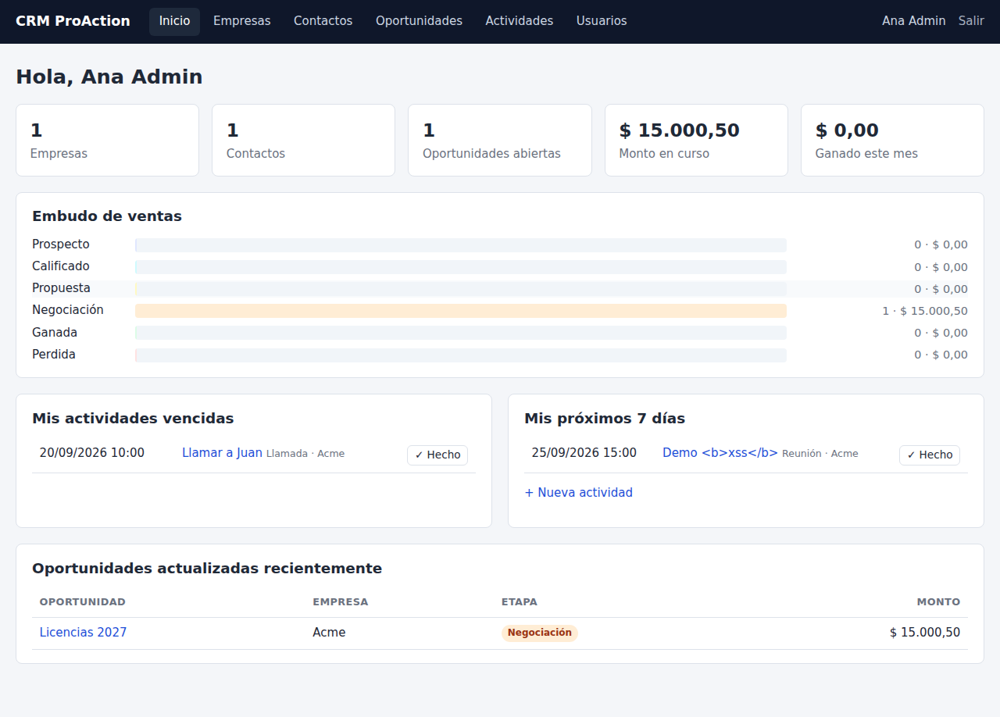

# CRM ProAction

CRM ligero para la intranet de la empresa. Está escrito en **PHP 8 + MySQL**, sin frameworks
ni Composer, para que se pueda subir por FTP o el administrador de archivos a cualquier
hosting corporativo (cPanel, Plesk, DirectAdmin, etc.).



## Funcionalidades

| Módulo | Qué incluye |
|---|---|
| **Inicio** | Totales, embudo de ventas por etapa, monto en curso, ganado del mes, mis actividades vencidas y próximas |
| **Empresas** | Alta/edición, ficha con contactos, oportunidades e historial de actividades, búsqueda, exportación CSV |
| **Contactos** | Vinculados a empresa, ficha con oportunidades y actividades, búsqueda, exportación CSV |
| **Oportunidades** | Tablero por etapa (Prospecto → Calificado → Propuesta → Negociación → Ganada/Perdida), cambio rápido de etapa, monto, probabilidad y fecha de cierre |
| **Actividades** | Llamadas, reuniones, correos, tareas y notas; asignación a usuarios; pendientes, vencidas y completadas |
| **Usuarios** | Roles Administrador/Usuario, activación y desactivación (solo administradores) |

### Seguridad incluida

- Contraseñas con `password_hash` (bcrypt/argon según el servidor).
- Consultas preparadas con PDO (sin inyección SQL) y escape de toda salida HTML (sin XSS).
- Token CSRF en todos los formularios.
- Bloqueo tras 5 intentos fallidos de inicio de sesión durante 15 minutos.
- Cookie de sesión `HttpOnly`/`SameSite` y expiración por inactividad.
- **Restricción por IP** para que solo se acceda desde la red de la empresa (`ips_permitidas`).
- Carpetas `app/`, `sql/` y `data/` y el archivo `config.php` bloqueados desde la web.

## Requisitos del hosting

- PHP **8.0 o superior** con la extensión `pdo_mysql` (viene en casi todos los hostings).
- MySQL 5.7+ o MariaDB 10.3+.
- Apache con `.htaccess` habilitado (si su hosting usa Nginx, vea la nota más abajo).

## Instalación en el hosting corporativo

1. **Cree la base de datos.** En cPanel: *Bases de datos MySQL* → cree una base (ej. `empresa_crm`),
   un usuario con contraseña segura y asígnele **todos los privilegios** sobre esa base.
2. **Suba los archivos.** Suba todo el contenido del repositorio a una carpeta del hosting,
   por ejemplo `public_html/crm/` o a un subdominio como `crm.suempresa.com`.
   No hace falta subir `docs/` ni `README.md`.
3. **Configure.** Copie `config.sample.php` como `config.php` y complete:
   - `db` → host (normalmente `localhost`), nombre de la base, usuario y contraseña.
   - `zona_horaria` y `moneda`.
   - `ips_permitidas` → la IP pública de la oficina (o rangos) para limitar el acceso a la intranet.
     Puede consultar la IP pública de la oficina entrando a <https://ifconfig.me> desde la red de la empresa.
4. **Instale.** Abra `https://suempresa.com/crm/install.php`, ingrese su nombre, correo y contraseña.
   Se crearán las tablas y el primer usuario administrador.
5. **Elimine `install.php`** del servidor (el instalador ya queda desactivado, pero es buena práctica).
6. **Active HTTPS.** Si su hosting tiene SSL (AutoSSL / Let's Encrypt), descomente el bloque
   *Forzar HTTPS* en `.htaccess`.
7. Entre en `login.php`, vaya a **Usuarios** y cree las cuentas de su equipo.

> Alternativa al paso 4: puede importar `sql/mysql.sql` desde phpMyAdmin, pero entonces tendrá que
> crear el primer usuario a mano. El instalador es más sencillo.

### ¿"Intranet" en un hosting público?

Un hosting corporativo está en Internet, así que el CRM se protege en tres capas:

1. **Restricción por IP** (`ips_permitidas` en `config.php`, y opcionalmente el bloque `Require ip`
   en `.htaccess`): solo se accede desde la oficina o la VPN de la empresa.
2. **Usuario y contraseña** para cada persona.
3. **HTTPS** para cifrar el tráfico.

Si el personal trabaja de forma remota, lo ideal es que se conecte por la VPN de la empresa, para
que salga a Internet con la IP de la oficina. Si no hay VPN, deje `ips_permitidas` vacío y confíe
en las contraseñas + HTTPS (menos seguro).

### Nota para Nginx

Nginx no lee `.htaccess`. Pida a su proveedor bloquear estas rutas:

```nginx
location ~ ^/crm/(app|sql|data|docs)/ { deny all; }
location ~ ^/crm/(config|config\.sample)\.php$ { deny all; }
```

## Probar en su computadora

Sin MySQL, usando SQLite:

```bash
cp config.sample.php config.php
# en config.php cambie 'driver' => 'sqlite'
php -S localhost:8000
# abra http://localhost:8000/install.php
```

## Estructura

```
index.php          Enrutador principal (index.php?r=modulo&a=accion)
login.php          Inicio de sesión
logout.php         Cierre de sesión
install.php        Instalador (eliminar después de usar)
config.sample.php  Plantilla de configuración
app/
  bootstrap.php    Carga de configuración, sesión y restricción por IP
  helpers.php      Escape, CSRF, formularios, CSV, catálogos (etapas, tipos, roles)
  db.php           Conexión PDO y funciones de consulta
  auth.php         Inicio de sesión, permisos, bloqueo por intentos, filtro de IP
  layout.php       Plantilla HTML, menú, paginación
  modules/         Un archivo por sección (empresas, contactos, oportunidades…)
sql/               Esquemas MySQL y SQLite
assets/style.css   Estilos (adaptados a celulares)
data/              Base SQLite (solo en modo prueba)
```

## Personalización rápida

- **Etapas del embudo, tipos de actividad y roles:** constantes `ETAPAS`, `TIPOS_ACTIVIDAD` y `ROLES`
  en `app/helpers.php`.
- **Colores:** variables al inicio de `assets/style.css`.
- **Nombre del sistema:** `app_nombre` en `config.php`.

## Copias de seguridad

Programe en cPanel (*Copias de seguridad* o una tarea cron) un respaldo diario de la base de datos:

```bash
mysqldump -u USUARIO -p'CLAVE' NOMBRE_BD | gzip > ~/respaldos/crm_$(date +\%F).sql.gz
```
